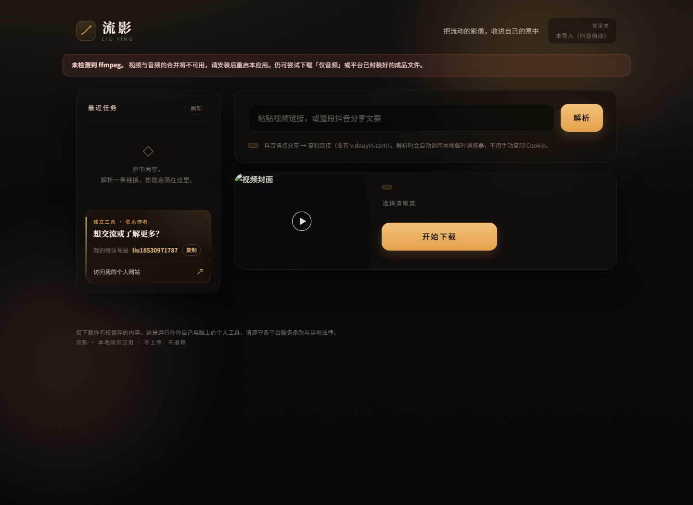

# 流影 · Liuying

> 把流动的影像，收进自己的匣中。

流影是一款运行在本机的公开视频下载器：复制分享链接，交给本地浏览器和下载引擎处理，视频最终保存到自己的电脑。它不依赖远程解析站，也不会把你的链接、Cookie 或下载内容上传到第三方服务。



## 产品亮点

- **本地优先**：FastAPI 后端和网页界面都运行在 `127.0.0.1`，下载文件保存在本机 `downloads/`。
- **抖音一键流程**：粘贴分享链接后，自动用隔离的临时 Chrome/Edge 打开公开视频，解析成功后自动排队最佳画质下载，不需要手动复制 Cookie。
- **多平台支持**：YouTube、哔哩哔哩、抖音、TikTok、Twitter/X 的公开视频。
- **不打扰的队列**：支持连续提交任务，实时显示解析、下载、合并进度。
- **失败边界清晰**：遇到验证码、登录墙、私密、地区限制或直播内容时停止，不绕过平台访问控制。

## 支持的平台

| 平台 | 链接示例 | 备注 |
| --- | --- | --- |
| YouTube | `youtube.com/watch`、`youtu.be` | 年龄限制内容需要自己的登录态 |
| 哔哩哔哩 | `bilibili.com/video`、`b23.tv` | 支持单条视频 |
| 抖音 | `douyin.com`、`v.douyin.com` | 普通公开视频自动解析并下载 |
| TikTok | `tiktok.com` | 支持公开视频 |
| Twitter / X | `twitter.com`、`x.com` | 支持公开推文视频 |

暂不支持私密视频、地区封锁内容、直播/预约直播、播放列表整单和超过 3 小时的影片。

## 快速开始

### Windows

1. 安装 Python 3.10 或更高版本。
2. 建议安装 Chrome 或 Edge；抖音自动解析需要本机 Chromium 浏览器。
3. 双击 `start.bat`。
4. 浏览器打开 <http://127.0.0.1:8787>。

### macOS / Linux

```bash
./start.sh
```

也可以手动启动：

```bash
python3 -m venv .venv
.venv/bin/pip install -r requirements.txt
.venv/bin/python -m uvicorn app.main:app --host 127.0.0.1 --port 8787
```

## 怎么用

1. 从平台复制视频分享链接，粘贴到输入框。
2. 点击「解析」。抖音公开视频会自动开始最佳画质下载。
3. 其他平台解析成功后，选择清晰度并点击「开始下载」。
4. 完成后从页面下载文件，或打开项目里的 `downloads/` 文件夹。

## 依赖说明

- **Python**：运行本地 API 和任务队列。
- **Chrome / Edge**：抖音公开页面的本地自动化解析。
- **ffmpeg（可选但推荐）**：合并分离的视频轨和音频轨，并支持音频提取。

如果没有 ffmpeg，抖音返回的成品 MP4 仍可直接保存；YouTube、哔哩哔哩等平台的最佳画质合并可能受影响。

## 隐私与安全

- 不使用远程解析服务，不把链接、视频或 Cookie 发到本项目之外。
- Cookie 和浏览器登录态只用于你自己配置的本机流程，保存在 `data/`。
- 下载内容保存在 `downloads/`，这两个目录都已加入 `.gitignore`，不会随代码提交。
- `.venv/`、日志、数据库和临时下载文件同样被忽略。
- 请只下载你有权保存的内容，并遵守各平台服务条款与当地法律。

## 项目结构

```text
app/
  main.py             FastAPI 路由
  downloader.py       yt-dlp 封装、任务队列和进度状态
  douyin_browser.py   本地隔离浏览器解析
  auth.py             本机 Cookie / 浏览器登录态管理
static/
  index.html          页面结构
  app.js              页面交互和任务轮询
  styles.css          深色琥珀视觉样式
tests/                URL、认证和抖音解析测试
docs/preview.png      干净的产品截图
data/                 本机登录态目录（不提交）
downloads/            本机下载目录（不提交）
```

## 联系作者

- 我的微信号是：`liu18530971787`
- 个人网站：<https://product-launch-studio.product-launch-studio.workers.dev/>

欢迎反馈使用问题、提交改进建议，或通过个人网站了解更多项目。

## License

本项目采用 MIT License，详见 [LICENSE](LICENSE)。
